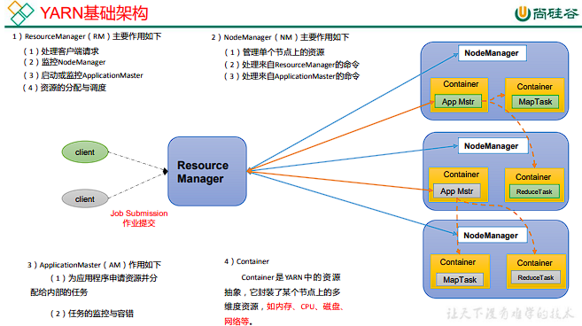

# Yarn introduction

**YARN**(Yet Another Resource Negotiator), was introduced in Hadoop version 2.0 by Yahoo and Hortonworks in 2012. 
The basic idea of YARN in Hadoop is to divide the functions of resource management and task scheduling/monitoring 
into separate daemon processes.

YARN in Hadoop allows for the execution of various data processing engines such as batch processing, graph processing, 
stream processing, and interactive processing, as well as the processing of data stored in HDFS.

> If you consider yarn as a Operating System for a distributed calculation cluster, then the jobs (MapReduce, spark, etc.)
> are the applications run on the OS.

## Why Yarn?

- better resource management: YARN in Hadoop `efficiently and dynamically` allocates all cluster resources, resulting 
          in higher Hadoop utilization compared to previous versions which help in better cluster utilization.
- support different job mode: It supports `streaming, interactive and batch jobs`
- support many calculation frameworks: It supports MapReduce(hadoop), Spark, etc.

## Concepts

The fundamental idea of YARN is to split up the functionalities of `resource management` and `job scheduling/monitoring` 
into separate daemons. The idea is to have a global ResourceManager (RM) and per-application ApplicationMaster (AM). 
**An application is either a single job or a DAG of jobs**.

Yarn has four principal concepts:
- **ResourceManager**: The ResourceManager is the ultimate authority that arbitrates resources among all the applications in the system.
- **NodeManager**: The NodeManager is the per-machine framework agent who is responsible for containers, monitoring 
              their resource usage (cpu, memory, disk, network) and reporting the same to the ResourceManager/Scheduler.
- **ApplicationMaster**: Each application will have it's own dedicated ApplicationMaster. It's specific for each 
                  framework(MR, spark, etc.). It negotiates resources from the `ResourceManager` and working with 
                  the `NodeManager(s)` to execute and monitor the tasks.
- **Container**: It is a collection of physical resources such as RAM, CPU cores, and disks on a single node (like a vm in a hypervisor).
             It is supervised by the NodeManager and scheduled by the ResourceManager. Container can have different
             


### Resource manager

The ResourceManager has two main components: 
- **Scheduler**: The Scheduler is responsible for allocating resources to the various running applications subject to 
                 familiar constraints of capacities, queues etc. The Scheduler is pure scheduler in the sense that it 
                 performs no monitoring or tracking of status for the application. Also, it offers no guarantees about 
                 restarting failed tasks either due to application failure or hardware failures. The Scheduler 
                 performs its scheduling function based on the resource requirements of the applications; 
                 it does so based on the abstract notion of a resource Container which incorporates elements 
                 such as memory, cpu, disk, network etc. The Scheduler has a `pluggable policy` which is responsible 
                 for partitioning the cluster resources among the various queues, applications etc. The current 
                schedulers such as the `CapacityScheduler` and the `FairScheduler` would be some examples of plug-ins.

- **ApplicationsManager**: The ApplicationsManager is responsible for accepting `job-submissions`, negotiating the 
                 first container for executing the application specific `ApplicationMaster` and provides the service 
                 for restarting the ApplicationMaster container on failure. The per-application ApplicationMaster 
                 has the responsibility of negotiating appropriate resource containers from the Scheduler, tracking 
                 their status and monitoring for progress.

## Workflow of yarn job

The workflow of yarn job for different framework is a bit different. The below workflow represents the MapReduce job

1. MR job submission via the client node 
2. YarnRunner(in the client node) send request to `(RM)ResourceManager` to create an Application。
3. RM will create an application and create a folder with the `aplication_id` in `hdfs://.../staging/`. This path
 will be sent back to YarnRunner。
4. YarnRunner will copy all application required files into this folder. 
5. After file upload, YarnRunner will require a `mrAppMaster`
6. RM will create a `task` from this request
7. One of the available NodeManager will take the task and run.
8. To run the task, the `NodeManager` first create a `MRAppmaster Container`
9. This `MRAppmaster Container` will copy the required code and conf from the HDFS to local node.
10. After downloading the code, this `MRAppmaster Container` will ask RM to run `MapTask`
11. RM uses `MapTask` to create tasks. The other available NodeManagers will take these tasks and create `MapTask Container` accordingly
12. `MRAppmaster Container` sends code and conf to the created `MapTask Container`, after receiving all requried 
    code and conf, NodeManager starts the MapTask in the `MapTask Container`.
13. `MRAppmaster Container` waits all MapTask terminate, then it will ask RM to start the `ReduceTask`.
14. Same as `MapTask`, the node manager will create `reduceTask container`
15. `ReduceTask Container` will ask `MapTask Container` to send their data.
16. After all tasks are executed, `MRAppmaster Container` will ask RM to clean.


## Useful commands

### General commands

```shell
# list all available node of the cluster
yarn node -list -all

# list all applications
yarn application -list

# you can filter the list by app state
yarn application -list -appStates FINISHED

# kill an application
yarn application -kill <application-id>

# check application log
yarn logs -applicationId <application-id>

# Check the log of a container
yarn logs -applicationld<Applicationld> -containerld<Containerld>

# check the status of a container
yarn container -status <Containerld>

# list the attempts of an application
yarn applicationattempt -list <Applicationld>

# get the status of an attempt
yarn applicationattempt -staus <ApplicatonAttemptld>

# get the container list of an attempt
yarn container -list <Application Attemptld>

```

### Queue commands

```shell
# reload the queue config
yarn rmadmin -refreshOueues

# check queue status
yarn queue -status <OueueName>
```

## Key config of yarn

Yarn has two import config files:
 - yarn-env.sh
 - yarn-site.xml

### yarn-env.sh

```shell
```

### yarn-site.xml

In yarn-site.xml, you need to pay attention to the below configuration

- yarn.resourcemananger.scheduler.class : define the cluster scheduler class(e.g. CapacityScheduler, FairScheduler) 
- yarn.resourcemananger.scheduler.client.thread-count: The thread number which will handler the yarn client request. 
                   Default value is 50, if you have more than 50 client which will send request to resource manager, 
                   you need to increase the thread count.

- yarn.nodemanager.resource.pcores-vcores-ratio: The ration of vcore(in yarn container) and physical core. Default value is 1.0
                  It means, if you have 8 core in your server, the yarn container can have 8 vcore at max. If you want to 
                  have more flexibility of the conf, you can set it to 2.0. It means the yarn container can have 16 vcore at max
- yarn.nodemanager.resource.cpu-vcores: It defines the max vcore a nodemanager can use in total. Default value is 8
- yarn.nodemanager.resource 
#### Resource manager config

```xml
<config-template>
     <property>
      <name>yarn.resourcemanager.address</name>
      <value>__HDP_RESOURCEMANAGER__:8050</value>
    </property>
    
    <property>
      <name>yarn.resourcemanager.admin.address</name>
      <value>__HDP_RESOURCEMANAGER__:8141</value>
    </property>
    
    <property>
      <name>yarn.resourcemanager.am.max-attempts</name>
      <value>2</value>
    </property>
    
    <property>
      <name>yarn.resourcemanager.bind-host</name>
      <value>0.0.0.0</value>
    </property>
    
    <property>
      <name>yarn.resourcemanager.connect.max-wait.ms</name>
      <value>900000</value>
    </property>
    
    <property>
      <name>yarn.resourcemanager.connect.retry-interval.ms</name>
      <value>30000</value>
    </property>
    
    <property>
      <name>yarn.resourcemanager.fs.state-store.retry-policy-spec</name>
      <value>2000, 500</value>
    </property>
    
    <property>
      <name>yarn.resourcemanager.fs.state-store.uri</name>
      <value> </value>
    </property>
    
    <property>
      <name>yarn.resourcemanager.ha.enabled</name>
      <value>false</value>
    </property>
    
    <property>
      <name>yarn.resourcemanager.hostname</name>
      <value>__HDP_RESOURCEMANAGER__</value>
    </property>
    
    <property>
      <name>yarn.resourcemanager.nodes.exclude-path</name>
      <value>/etc/hadoop/conf/yarn.exclude</value>
    </property>
    
    <property>
      <name>yarn.resourcemanager.recovery.enabled</name>
      <value>true</value>
    </property>
    
    <property>
      <name>yarn.resourcemanager.resource-tracker.address</name>
      <value>__HDP_RESOURCEMANAGER__:8025</value>
    </property>
    
    <property>
      <name>yarn.resourcemanager.scheduler.address</name>
      <value>__HDP_RESOURCEMANAGER__:8030</value>
    </property>
    
    <property>
      <name>yarn.resourcemanager.scheduler.class</name>
      <value>org.apache.hadoop.yarn.server.resourcemanager.scheduler.capacity.CapacityScheduler</value>
    </property>
    
    <property>
      <name>yarn.resourcemanager.scheduler.monitor.enable</name>
      <value>false</value>
    </property>
    
    <property>
      <name>yarn.resourcemanager.state-store.max-completed-applications</name>
      <value>${yarn.resourcemanager.max-completed-applications}</value>
    </property>
    
    <property>
      <name>yarn.resourcemanager.store.class</name>
      <value>org.apache.hadoop.yarn.server.resourcemanager.recovery.ZKRMStateStore</value>
    </property>
    
    <property>
      <name>yarn.resourcemanager.system-metrics-publisher.dispatcher.pool-size</name>
      <value>10</value>
    </property>
    
    <property>
      <name>yarn.resourcemanager.system-metrics-publisher.enabled</name>
      <value>true</value>
    </property>
    
    <property>
      <name>yarn.resourcemanager.webapp.address</name>
      <value>__HDP_RESOURCEMANAGER__:8088</value>
    </property>
    
    <property>
      <name>yarn.resourcemanager.webapp.delegation-token-auth-filter.enabled</name>
      <value>false</value>
    </property>
    
    <property>
      <name>yarn.resourcemanager.webapp.https.address</name>
      <value>__HDP_RESOURCEMANAGER__:8090</value>
    </property>
    
    <property>
      <name>yarn.resourcemanager.work-preserving-recovery.enabled</name>
      <value>true</value>
    </property>
    
    <property>
      <name>yarn.resourcemanager.work-preserving-recovery.scheduling-wait-ms</name>
      <value>10000</value>
    </property>
    
    <property>
      <name>yarn.resourcemanager.zk-acl</name>
      <value>world:anyone:rwcda</value>
    </property>
    
    <property>
      <name>yarn.resourcemanager.zk-address</name>
      <value>__HDP_ZOOKEEPER_HOSTS_WITH_PORT__</value>
    </property>
    
    <property>
      <name>yarn.resourcemanager.zk-num-retries</name>
      <value>1000</value>
    </property>
    
    <property>
      <name>yarn.resourcemanager.zk-retry-interval-ms</name>
      <value>1000</value>
    </property>
    
    <property>
      <name>yarn.resourcemanager.zk-state-store.parent-path</name>
      <value>/rmstore</value>
    </property>
    
    <property>
      <name>yarn.resourcemanager.zk-timeout-ms</name>
      <value>10000</value>
    </property>
</config-template>
```

#### scheduler config

```xml
<config-template>
    <property>
      <name>yarn.scheduler.maximum-allocation-mb</name>
      <value>8192</value>
      <!-- [DE239909] tune for DCAE CDAP -->
    </property>
    
    <property>
      <name>yarn.scheduler.maximum-allocation-vcores</name>
      <value>2</value>
    </property>
    
    <property>
      <name>yarn.scheduler.minimum-allocation-mb</name>
      <value>512</value>
      <!-- [DE239909] tune for DCAE CDAP -->
    </property>
    
    <property>
      <name>yarn.scheduler.minimum-allocation-vcores</name>
      <value>1</value>
    </property>
    
</config-template>
```

#### node manager config

```xml
<config-template>
    <property>
      <name>yarn.nodemanager.address</name>
      <value>0.0.0.0:45454</value>
    </property>
    
    <property>
      <name>yarn.nodemanager.admin-env</name>
      <value>MALLOC_ARENA_MAX=$MALLOC_ARENA_MAX</value>
    </property>
    
    <property>
      <name>yarn.nodemanager.aux-services</name>
      <value>mapreduce_shuffle</value>
    </property>
    
    <property>
      <name>yarn.nodemanager.aux-services.mapreduce_shuffle.class</name>
      <value>org.apache.hadoop.mapred.ShuffleHandler</value>
    </property>
    
    <property>
      <name>yarn.nodemanager.bind-host</name>
      <value>0.0.0.0</value>
    </property>
    
    <property>
      <name>yarn.nodemanager.container-executor.class</name>
      <value>org.apache.hadoop.yarn.server.nodemanager.DefaultContainerExecutor</value>
    </property>
    
    <property>
      <name>yarn.nodemanager.container-monitor.interval-ms</name>
      <value>3000</value>
    </property>
    
    <property>
      <name>yarn.nodemanager.delete.debug-delay-sec</name>
      <value>43200</value>
      <!-- [DE239909] tune for DCAE CDAP -->
    </property>
    
    <property>
      <name>yarn.nodemanager.disk-health-checker.max-disk-utilization-per-disk-percentage</name>
      <value>90</value>
    </property>
    
    <property>
      <name>yarn.nodemanager.disk-health-checker.min-free-space-per-disk-mb</name>
      <value>1000</value>
    </property>
    
    <property>
      <name>yarn.nodemanager.disk-health-checker.min-healthy-disks</name>
      <value>0.25</value>
    </property>
    
    <property>
      <name>yarn.nodemanager.health-checker.interval-ms</name>
      <value>135000</value>
    </property>
    
    <property>
      <name>yarn.nodemanager.health-checker.script.timeout-ms</name>
      <value>60000</value>
    </property>
    
    <property>
      <name>yarn.nodemanager.linux-container-executor.cgroups.hierarchy</name>
      <value>hadoop-yarn</value>
    </property>
    
    <property>
      <name>yarn.nodemanager.linux-container-executor.cgroups.mount</name>
      <value>false</value>
    </property>
    
    <property>
      <name>yarn.nodemanager.linux-container-executor.cgroups.strict-resource-usage</name>
      <value>false</value>
    </property>
    
    <property>
      <name>yarn.nodemanager.linux-container-executor.group</name>
      <value>hadoop</value>
    </property>
    
    <property>
      <name>yarn.nodemanager.linux-container-executor.resources-handler.class</name>
      <value>org.apache.hadoop.yarn.server.nodemanager.util.DefaultLCEResourcesHandler</value>
    </property>
    
    <property>
      <name>yarn.nodemanager.local-dirs</name>
      <value>__YARN_LOCAL_DIR__</value>
    </property>
    
    <property>
      <name>yarn.nodemanager.log-aggregation.compression-type</name>
      <value>gz</value>
    </property>
    
    <property>
      <name>yarn.nodemanager.log-aggregation.debug-enabled</name>
      <value>false</value>
    </property>
    
    <property>
      <name>yarn.nodemanager.log-aggregation.num-log-files-per-app</name>
      <value>30</value>
    </property>
    
    <property>
      <name>yarn.nodemanager.log-aggregation.roll-monitoring-interval-seconds</name>
      <value>-1</value>
    </property>
    
    <property>
      <name>yarn.nodemanager.log-dirs</name>
      <value>__YARN_LOG_DIR__</value>
    </property>
    
    <property>
      <name>yarn.nodemanager.log.retain-second</name>
      <value>604800</value>
    </property>
    
    <property>
      <name>yarn.nodemanager.recovery.dir</name>
      <value>__YARN_NODEMANAGER_RECOVERY_DIR__</value>
    </property>
    
    <property>
      <name>yarn.nodemanager.recovery.enabled</name>
      <value>true</value>
    </property>
    
    <property>
      <name>yarn.nodemanager.remote-app-log-dir</name>
      <value>/app-logs</value>
    </property>
    
    <property>
      <name>yarn.nodemanager.remote-app-log-dir-suffix</name>
      <value>logs</value>
    </property>
    
    <property>
      <name>yarn.nodemanager.resource.cpu-vcores</name>
      <value>6</value>
    </property>
    
    <property>
      <name>yarn.nodemanager.resource.memory-mb</name>
      <value>15360</value>
    </property>
    
    <property>
      <name>yarn.nodemanager.resource.percentage-physical-cpu-limit</name>
      <value>80</value>
    </property>
    
    <property>
      <name>yarn.nodemanager.vmem-check-enabled</name>
      <value>false</value>
    </property>
    
    <property>
      <name>yarn.nodemanager.vmem-pmem-ratio</name>
      <value>2.1</value>
    </property>
    
    <property>
      <name>yarn.nodemanager.resource.pcores-vcores-ratio</name>
      <value>2.1</value>
    </property>
</config-template>
```
#### Yarn timeline server 

The yarn timeline server can store history of the yarn application. It work likes the spark history server.

For a registered application, you can the below information:

- application queue name
- The conf and user profile inside the ApplicationSubmissionContext
- The attempt list of the Application
- The container list of the attempt
- The info of the Container

Below is a template for yarn timeline service config, you need to edit it.

```xml
<cofnig>
<property>
      <name>yarn.timeline-service.address</name>
      <value>__HDP_APP_TIMELINE_SERVER__:10200</value>
    </property>
    
    <property>
      <name>yarn.timeline-service.bind-host</name>
      <value>0.0.0.0</value>
    </property>
    
    <property>
      <name>yarn.timeline-service.client.max-retries</name>
      <value>30</value>
    </property>
    
    <property>
      <name>yarn.timeline-service.client.retry-interval-ms</name>
      <value>1000</value>
    </property>
    
    <property>
      <name>yarn.timeline-service.enabled</name>
      <value>true</value>
    </property>
    
    <property>
      <name>yarn.timeline-service.generic-application-history.store-class</name>
      <value>org.apache.hadoop.yarn.server.applicationhistoryservice.NullApplicationHistoryStore</value>
    </property>
    
    <property>
      <name>yarn.timeline-service.http-authentication.simple.anonymous.allowed</name>
      <value>true</value>
    </property>
    
    <property>
      <name>yarn.timeline-service.http-authentication.type</name>
      <value>simple</value>
    </property>
    
    <property>
      <name>yarn.timeline-service.leveldb-state-store.path</name>
      <value>/grid/0/hadoop/yarn/timeline</value>
    </property>
    
    <property>
      <name>yarn.timeline-service.leveldb-timeline-store.path</name>
      <value>/grid/0/hadoop/yarn/timeline</value>
    </property>
    
    <property>
      <name>yarn.timeline-service.leveldb-timeline-store.read-cache-size</name>
      <value>104857600</value>
    </property>
    
    <property>
      <name>yarn.timeline-service.leveldb-timeline-store.start-time-read-cache-size</name>
      <value>10000</value>
    </property>
    
    <property>
      <name>yarn.timeline-service.leveldb-timeline-store.start-time-write-cache-size</name>
      <value>10000</value>
    </property>
    
    <property>
      <name>yarn.timeline-service.leveldb-timeline-store.ttl-interval-ms</name>
      <value>300000</value>
    </property>
    
    <property>
      <name>yarn.timeline-service.recovery.enabled</name>
      <value>true</value>
    </property>
    
    <property>
      <name>yarn.timeline-service.state-store-class</name>
      <value>org.apache.hadoop.yarn.server.timeline.recovery.LeveldbTimelineStateStore</value>
    </property>
    
    <property>
      <name>yarn.timeline-service.store-class</name>
      <value>org.apache.hadoop.yarn.server.timeline.LeveldbTimelineStore</value>
    </property>
    
    <property>
      <name>yarn.timeline-service.ttl-enable</name>
      <value>true</value>
    </property>
    
    <property>
      <name>yarn.timeline-service.ttl-ms</name>
      <value>2678400000</value>
    </property>
    
    <property>
      <name>yarn.timeline-service.webapp.address</name>
      <value>__HDP_APP_TIMELINE_SERVER__:8188</value>
    </property>
    
    <property>
      <name>yarn.timeline-service.webapp.https.address</name>
      <value>__HDP_APP_TIMELINE_SERVER__:8190</value>
    </property>

</cofnig>
```


To complete with this link https://open.alipay.com/portal/forum/post/126201025?ant_source=opendoc_recommend