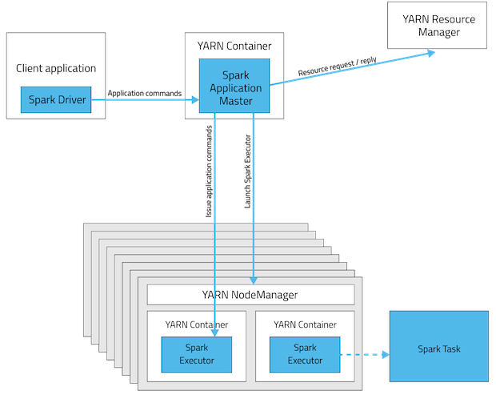

# Spark submit parameters

In this tutorial, we will show different spark submit commands with various options. All spark script for spark submit,
don't the following in the sparkSession creation. It will take no effect
- reserve the `cpu and memory for driver, executor` 
- include the dependencies jar
- etc.

Below is an example of the spark session creation

```python

```

## Submit python script

### Various master URLs

Spark support various master, the supported `master url` can be in one of the following formats:
- `local` :	Run Spark locally with one worker thread (i.e. no parallelism at all).
- `local[K]`: Run Spark locally with K worker threads (ideally, set this to the number of cores on your machine).
- `local[K,F]`:	Run Spark locally with K worker threads and F maxFailures (see `spark.task.maxFailures` for an explanation of this variable).
- `local[*]`: Run Spark locally with as many worker threads as logical cores on your machine.
- `local[*,F]`:	Run Spark locally with as many worker threads as logical cores on your machine and F maxFailures.
- `local-cluster[N,C,M]`: Local-cluster mode is only for unit tests. It emulates a distributed cluster in a single 
                JVM with N number of workers, C cores per worker and M MiB of memory per worker.
- `spark://HOST:PORT`:	Connect to the given `Spark standalone cluster master`. The port must be whichever one your 
                master is configured to use, which is 7077 by default.
- `spark://HOST1:PORT1,HOST2:PORT2`: Connect to the given `Spark standalone cluster with standby masters with Zookeeper`. 
                The list must have all the master hosts in the high availability cluster set up with Zookeeper. 
                 The port must be whichever each master is configured to use, which is 7077 by default.
- `yarn`: Connect to a YARN cluster in client or cluster mode depending on the value of `--deploy-mode`. The cluster 
             location will be found based on the `HADOOP_CONF_DIR` or `YARN_CONF_DIR` variable.
- `k8s://HOST:PORT`: Connect to a Kubernetes cluster in client or cluster mode depending on the value of 
                  `--deploy-mode`. The HOST and PORT refer to the Kubernetes API Server. It connects using 
                   TLS by default. In order to force it to use an unsecured connection, you can use k8s://http://HOST:PORT.
- `mesos://HOST:PORT(no one use it anymore)`: Connect to the given Mesos cluster. 

> The `spark.task.maxFailures` defines the max number of continuous failures of any particular task before giving 
> up on the job. The default value is 4.

### Command examples

Below are some spark submit command example

#### Local mode

Local mode is quite simple, as all `driver, worker` are only simulated threads, so no need to configure cpu, memory, and
extra dependencies, custom log config in the submit command.

```shell
# Run application locally on 8 cores
./bin/spark-submit \
  --master local[8] \
  /path/to/examples/src/main/python/pi.py \
  1000
```

#### Spark standalone cluster
You can find the official doc [here](https://spark.apache.org/docs/latest/spark-standalone.html)

```shell
# Run on a Spark standalone cluster in client deploy mode
./bin/spark-submit \
  --master spark://207.184.161.138:7077 \
  /path/to/examples/src/main/python/pi.py \
  1000

# Run on a Spark standalone cluster in cluster deploy mode with supervise
./bin/spark-submit \
  --master spark://207.184.161.138:7077 \
  --deploy-mode cluster \
  --supervise \
  /path/to/examples/src/main/python/pi.py \
  1000
```
> In spark standalone cluster mode, you can use the `--supervise` flag, to restart your application automatically if 
> it exited with non-zero exit code.

#### Hadoop Yarn cluster

You can find the official doc [here](https://spark.apache.org/docs/latest/running-on-yarn.html)

Yarn supports two deploy-mode:
- `client` : in client mode, the driver runs on the computer which submits the job. An `Application Master(AM)` will be created
            to control the workers. If the job has complexe dags, you may need to increase the resource of the `AM`.

This figure shows the client mode archi:



- `cluster` : in cluster mode, the driver runs on a worker of the cluster. The `driver` will play the role of `AM`, 
             so no need to set up resource for `AM`.

This figure shows the cluster mode archi:


```shell
# Run on a YARN cluster in client deploy mode
export HADOOP_CONF_DIR=XXX
./bin/spark-submit \
  --master yarn \
  --deploy-mode client \
  --conf spark.yarn.queue=prod \
  --conf spark.yarn.am.memory=4g \
  --conf spark.yarn.am.cores=2 \
  /path/to/examples/src/main/python/pi.py \
  1000
  
  
# Run on a YARN cluster in cluster deploy mode
export HADOOP_CONF_DIR=XXX
./bin/spark-submit \
  --master yarn \
  --deploy-mode cluster \
  --conf spark.yarn.queue=prod \
  /path/to/examples/src/main/python/pi.py \
  1000
```

> The default value for `spark.yarn.am.memory` is 512m, `spark.yarn.am.cores` is 1 
> Yarn has a concept of queue, the cluster may have one or more queue, and you must submit your job to the right queue
> By default, spark-submit use the queue `default`, if the cluster does not have a `default` queue, the submit will
> not work

#### K8s cluster

```shell

# Run on a Kubernetes cluster in cluster deploy mode
./bin/spark-submit \
  --master k8s://xx.yy.zz.ww:443 \
  --deploy-mode cluster \
  --executor-memory 20G \
  --num-executors 50 \
  http://path/to/examples.jar \
  1000
```

### Cluster resource options

When running in submit mode, you need to set up the cluster resources with the below options:
- driver-memory 4g \
- driver-cores 2 \
- executor-memory 8g \
- executor-cores 4 \
- num-executors 10 \

Below is a full example

```shell
spark-submit \
  --master yarn \
  --deploy-mode cluster \
  --driver-memory 4g \
  --driver-cores 2 \
  --executor-memory 8g \
  --executor-cores 4 \
  --num-executors 10 \
  --conf spark.some.config.option=value \
  /path/to/examples/src/main/python/pi.py \
  1000 
```

To avoid typing them every time, you can add them to your `spark-default.conf`

Check this `spark-default.conf` template [file](../../../src/hadoop_conf_templates/spark/spark-defaults.conf)

### Python submit options

To submit python script, you may need to check the below options

#### Skip uploading the spark required jars

By default, the spark-submit will zip all the dependencies jar of your local spark-home and send them to the cluster, 
to make sure the cluster has the same spark jar as your local env. If you are sure, you can upload them to the hdfs
and ask spark-submit to skip this step by using the below option

```shell
--conf spark.yarn.archive=hdfs:///system/libs/spark_libs.zip
```

#### Specify custom python binary location

If the python binary on the spark cluster is not the standard locaiton, you can specify the python bin path in the spark
submit command


```shell

spark-submit --master yarn --deploy-mode cluster 
 --conf spark.pyspark.driver.python=/usr/bin/python3 --conf spark.pyspark.python=/usr/bin/python3 --conf spark.yarn.am.memory=4g
```

### Custom spark log config

The spark cluster has a default log4j properties(https://github.com/apache/spark/blob/master/conf/log4j2.properties.template), 
you can overwrite this config by using your own config.

```shell
--files "/path/to/custom/log4j.properties" \
--conf "spark.driver.extraJavaOptions=-Dlog4j.configuration=file:/path/to/custom/log4j.properties"
--conf "spark.executor.extraJavaOptions=-Dlog4j.configuration=file:/path/to/custom/log4j.properties"
```

> The `--files "/path/to/custom/log4j.properties"` option distributes the custom log4j file to all nodes in the cluster
> 
> 
### Other useful examples

```shell
./bin/spark2-submit \
--master yarn \
--deploy-mode cluster \
--conf "spark.sql.shuffle.partitions=20000" \
--conf "spark.executor.memoryOverhead=5244" \
--conf "spark.memory.fraction=0.8" \
--conf "spark.memory.storageFraction=0.2" \
--conf "spark.serializer=org.apache.spark.serializer.KryoSerializer" \
--conf "spark.sql.files.maxPartitionBytes=168435456" \
--conf "spark.dynamicAllocation.minExecutors=1" \
--conf "spark.dynamicAllocation.maxExecutors=200" \
--conf "spark.dynamicAllocation.enabled=true" \
--conf "spark.executor.extraJavaOptions=-XX:+PrintGCDetails -XX:+PrintGCTimeStamps" \ 
--files /path/log4j.properties,/path/file2.conf,/path/file3.json \
--class org.apache.spark.examples.SparkPi \
/spark-home/examples/jars/spark-examples_repace-spark-version.jar 80
```
